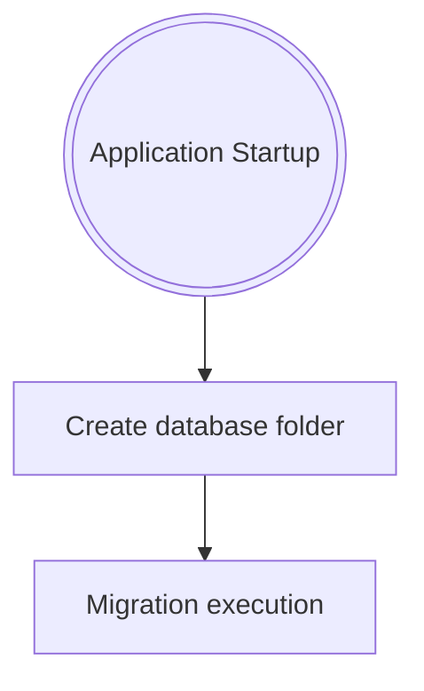

# Support Tool

## Description

- line 1
- line 2

## Getting Started

Follow these steps to set up the project locally.

### 1. Clone the repository

```bash
git clone <repo-url>
cd SupportTool
```

### 2. Create a virtual environment (Optional but reccomended)

```bash
python -m venv .venv
.venv\Scripts\activate
```

### 3. Install dependencies

```bash
pip install -r requirements.txt
```

### 4. Enable pre-commit hooks (IMPORTANT)

This automatically checks your code before every commit.

```bash
pre-commit install
```

You only need to do this once.

(Optional) Run all checks manually:

```bash
pre-commit run --all-files
```

To run all the tests:

```bash
python -m pytest
```

### 5. Run the application

```bash
python main.py
```

## Tecnical Documentation

### Database



$\rightarrow$ To obtain the database connection: `Database.get_connection(DatabaseType.PRODUCTION)`

## Platforms

| Platform | Availability |
| --- | --- |
| Windows | ✅ |
| Linux | ❌ |
| MacOS | ❌ |

## Supported Languages

| Piattaforma | Availability |
| --- | --- |
| Italian | ✅ |

## Licence

[](https://choosealicense.com/licenses/mit/)

## Authors

- [DennisTurco](https://www.github.com/DennisTurco)
- [Shard Hardware & Software](https://www.github.com/ShardPC)
- [Donatello La Rocca](https://www.github.com/)

## Support

For support:

- [dennisturco@gmail.com](dennisturco@gmail.com)
- [software@shardpc.it](software@shardpc.it)
- [donatello@gmail.com](donatello@gmail.com)

## Guida per fare un commit

### Setup Git

1. Installo git da questo [link](https://github.com/git-for-windows/git/releases/download/v2.53.0.windows.1/Git-2.53.0-64-bit.exe)
2. Apro cmd e controllo se installa correttamente inserendo "git --version"
3. Setto il mio utente di github su git, da terminale, inserendo i seguenti comandi:
    - git config --global user.name "name" (non username)
    - git config --global user.email "email"

### Come Commitare le modifiche sul progetto

1. Prima di iniziare un nuovo Task occorre spostarsi sul branch master, in basso a sinistra, e pullare(scaricare) la nuova versione del master
2. Seleziono in basso a sinistra del programma vscode la dicitura "master" e in alto mi apparirà un prompt, seleziono "+ Create new Branch"
3. Nel "+ Create new Branch" inserisco il nome del Branch(titolo che rappresenta il task)
4. Mi sposto nella sezione ad albero(simile all'icona di Git), terza in alto a sinistra, e committo i cambiamenti effettuati inserendo
   una descrizione delle modifiche apportate, Es. "Refactoring Codice", "Update Class ..."
5. Quando il task é completato si procede a Pubblicare il Branch
6. Si crea la "Pull Request"
7. Si richiede l'approvazione della "Pull Request"
8. Una volta approvata si schiaccia su "Merge"
